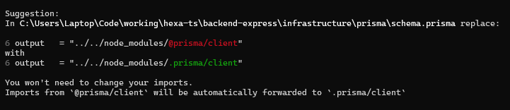
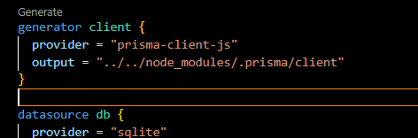

# Proceso

## 1. Migración `backend-express/prisma` -> `backend-express/infrastructure/prisma`
### Objetivo principal
Mover la carpeta de `prisma` de `backend-express` (ruta raíz) a `backend-express/infrastructure`, para tener mas consistencia en la estructura hexagonal.
### Detalles
#### Añadir/modificar output en `schema.prisma`
- Indicar en el generador del archivo `schema.prisma` donde esta "ubicado" el `@prisma/client`. Para ello debemos apuntar a nuestro `node_modules`, pero en vez de apuntar como: `...node_modules/@prisma/client` debemos apuntar indicando `.prisma/client`, para evitar el siguiente warning:
    
- Para este ejemplo quedara así:
    

#### Generar y migrar Prisma apuntando a la nueva ruta
- Apuntar a la nueva ruta a la hora de ejecutar comandos "Prisma", para ello, utilizaremos la bandera `--schema`.